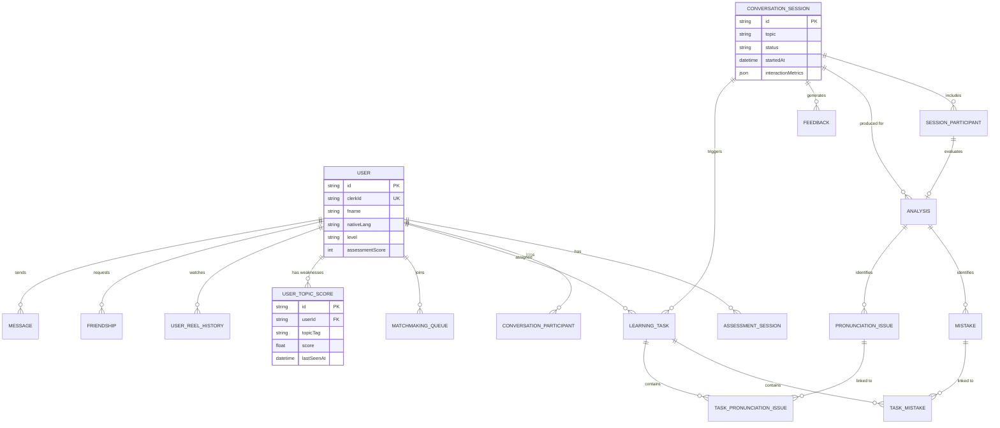

# Data Schema & ERD

The EngR App uses a PostgreSQL database for persistent storage, managed through **Prisma ORM**. Redis is used for real-time caching of matchmaking queues and user sessions.

## 1. Database Technology

- **Main Database:** PostgreSQL (Neon)
- **ORM:** Prisma
- **Cache / Message Broker:** Redis (Upstash)
- **CMS (External):** Strapi (PostgreSQL)

---

## 2. Entity-Relationship Diagram (ERD)

The following diagram illustrates the core relationships between users, sessions, analyses, and weaknesses.

---

## 3. Core Entities

### A. User Management (`User`, `Profile`)
- **`User`**: The central entity, containing basic user info, CEFR levels, and clerk identification.
- **`Profile`**: Extended user data (bio, avatar, avatar URL).
- **`UserTopicScore`**: Tracks the user's competency (or weakness) for specific tags (e.g., "past_tense"). This drives the personalized feed algorithm.

### B. Sessions & Interaction (`ConversationSession`, `SessionParticipant`)
- **`ConversationSession`**: Represents a live interaction (user-to-user call or AI-tutor session).
- **`SessionParticipant`**: Join table between users and sessions, tracking participation metrics like `speakingTime` and `turnsTaken`.

### C. AI Insights (`Analysis`, `Mistake`, `PronunciationIssue`)
- **`Analysis`**: The result of an AI breakdown for a specific participant in a session. Stores `cefrLevel` and raw JSON data.
- **`Mistake`**: Atomic grammatical or vocabulary error identified by Gemini.
- **`PronunciationIssue`**: Phonetic-level error identified by Azure/FastAPI.

### D. Gamification & Progression (`UserPoints`, `UserAchievement`, `StreakHistory`)
- **`UserPoints`**: Tracks cumulative experience points (XP) and current level.
- **`UserAchievement`**: Badges unlocked through specific interaction milestones.
- **`StreakHistory`**: Keeps track of daily engagement to drive retention.

---

## 4. Federated Data (External Sources)

### Strapi CMS (eBites Content)
Reel (video) metadata is fetched from Strapi. The `strapiReelId` is stored in `UserReelHistory` within the main PostgreSQL database to track user watch history and completion rates.

### Mux (Video Streaming)
Mux `playbackId` values are stored in the Strapi CMS and delivered to the mobile app for low-latency video playback.

---

## 5. Caching Strategy (Redis)

- **Matchmaking:** Users in the `MatchmakingQueue` status are cached in Redis to allow fast polling and room creation.
- **Real-time Presences:** Tracks active users for online status indicators.
- **Session Throttling:** API rate limiting counters.
